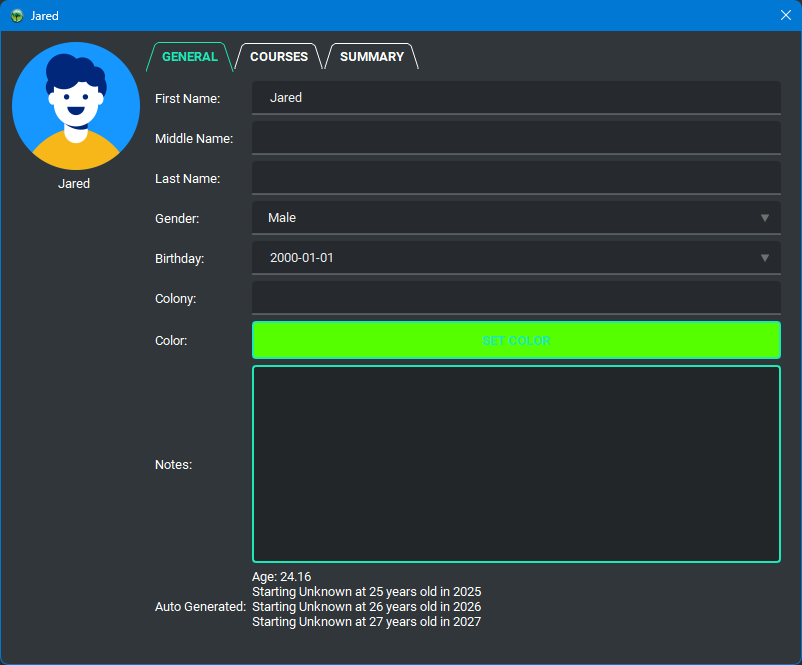

    

    
    
    
    
    
    
    

    
    
    

    

<h1>Gradebook</h1>

A gradebook for teachers. Formerly known as Gradiance.

<h2>About Gradebook</h2>

An open-source software designed to simplify the process of managing grades and generating reports for educators. Started as a personal project, it aims to provide a user-friendly interface for teachers to efficiently track student progress and performance.

<h2>Demo</h2>

    
    
    
    
    
    
    
    

