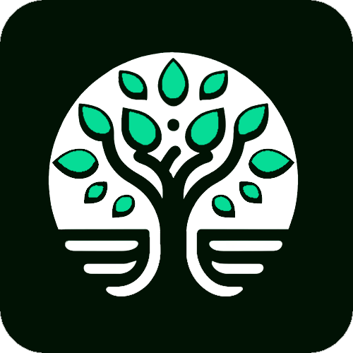

    

    
    
    
    
    
    
    

    
    
    
</a>

    
</a>

# Gradiance

A gradebook for teachers.

## About Gradiance

Gradiance is an open-source gradebook software designed to simplify the process of managing grades and generating reports for educators. Started as a personal project, Gradiance aims to provide a user-friendly interface for teachers to efficiently track student progress and performance.

## Features
**Grade Management:** Easily input and manage grades for individual students or entire classes.

**Report Generation:** Generate comprehensive student report cards that are designed with html, css, and javascript.

**Integration with Educational Games:** In the future, Gradiance aims to integrate with educational games hosted on a server, allowing students to engage in interactive learning experiences tied to their Gradiance accounts. These games cover various subjects such as math, English, spelling, and quizzes.

**Graphical Representation:** Gradiance offers graphical representations of student assessments, enabling educators to visualize data and derive meaningful insights.

**Statistical Analysis Tools:** In addition to graphs, Gradiance plans to incorporate more statistical analysis tools in the future, empowering educators to conduct in-depth analysis of student performance trends and patterns.

## Future Development

The vision for Gradiance extends beyond traditional gradebook functionalities. We aim to create a holistic educational ecosystem where teachers can seamlessly integrate interactive learning experiences into their curriculum that expresses each teachers unique teaching style. By combining grade management with educational games, we strive to enhance student engagement and foster a dynamic learning environment.

## Get Involved

Gradiance is an open-source project, and we welcome contributions from the community. Whether you're a developer, educator, or student passionate about improving educational tools, there are various ways to get involved:

**Contribute Ideas:** Whether you're an educator with insights into classroom needs, a developer with innovative feature suggestions, or a student with ideas for engaging educational content, we want to hear from you and improve Gradiance!

**Educational Content Suggestions:** Are you passionate about educational games or interactive learning experiences? Propose ideas for new games, quizzes, or learning modules that could be integrated with Gradiance to enrich the educational experience for students.

**Contribute Code:** Help us improve Gradiance by contributing code, fixing bugs, or implementing new features.

**Testing and Feedback:** Provide feedback on existing features and help us identify areas for improvement.

**Spread the Word:** Share Gradiance with your colleagues and fellow educators to help us grow our community.

Join us in shaping the future of educational technology with Gradiance!

## Demo:

